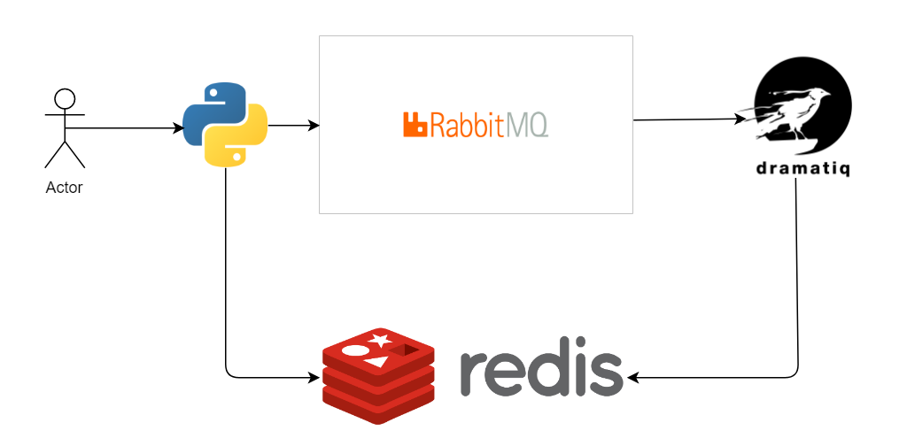

# geolocation-service

## Overview
An asynchronous geolocation service to perform geocoding of addresses and reverse-geocoding of long/lat coordinates.



## Dramatiq
A fast and reliable distributed task processing library for Python 3. https://dramatiq.io

Why dramatiq?

https://dramatiq.io/motivation.html

    1. High reliability and performance
    2. Simple and easy to understand core
    3. Convention over configuration

Most of the features are equivalent between Celery and Dramatiq

. Asynchronous communication

. Parallel processing

. Event-driven protocols

. Multi-platform Execution 

Still, I decided to go for Dramatiq  for the below reason

1. Simple learning curve
2. Task Prioritization 
3. Code auto-reload using watch library makes development easy
4. Reliable delivery.
5. Can learn more by experimenting with documentation and examples given since developer community & Stack overflow supports are less

NOTE:

https://stackoverflow.com/search?q=celery (17,105 results)

https://stackoverflow.com/search?q=dramatiq(6 results)


## Message Broker - RabbitMQ
RabbitMQ is an opensource message broker

RabbitMQ is lightweight and easy to deploy on premises and in the cloud. It supports multiple messaging protocols

RabbitMQ can be deployed in distributed and federated configurations to meet high-scale, high-availability requirements.

https://www.rabbitmq.com/install-windows-manual.html

Open "RabbitMQ Command Prompt (sbin dir)" and run the following command

```bash
rabbitmq-plugins enable rabbitmq_management
```
It will enable all the plugins that is associated with the RabbitMQ. Now open the browser and type http://localhost:15672 it will open a RabbitMQ console login with "guest as username" and "guest as password".

## Backend - Redis

Redis is an open source in-memory data structure store, used as a database, cache and message broker.

It supports data structures such as strings, hashes, lists, sets, sorted sets with range queries, bitmaps, hyperloglogs, geospatial indexes with radius queries and streams

https://redislabs.com/blog/redis-on-windows-10/


## Geocoder

Simple and consistent geocoding library written in Python. 

https://github.com/DenisCarriere/geocoder

Used OSM (OpenStreetMap) geocoding provider.

```bash
>>> import geocoder
>>> g = geocoder.osm('New York city')
>>> g.json
```

# Installation

1. Install RabbitMQ and Redis

2. Geocoder
```bash
$ pip install geocoder
```
3. Dramatiq with RabbitMQ
```bash
$ pip install dramatiq[rabbitmq]
```
4. Dramatiq with Redis
```bash
$ pip install dramatiq[redis]
```
5. Watch
```bash
$ pip install watchdog_gevent
$ pip install watchdog
```

# Running the application
1. Run RabbitMQ: rabbitmq-server
2. Run Redis: redis-server
3. Run a batch file workers.bat
4. In another terminal, run python main.py "H. C. Andersens Blvd. 27, 1553 København V, Denmark"
5. In another terminal, run python main.py "(55.674146, 12.569553)"
